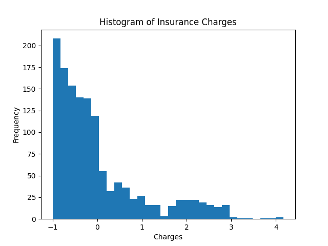
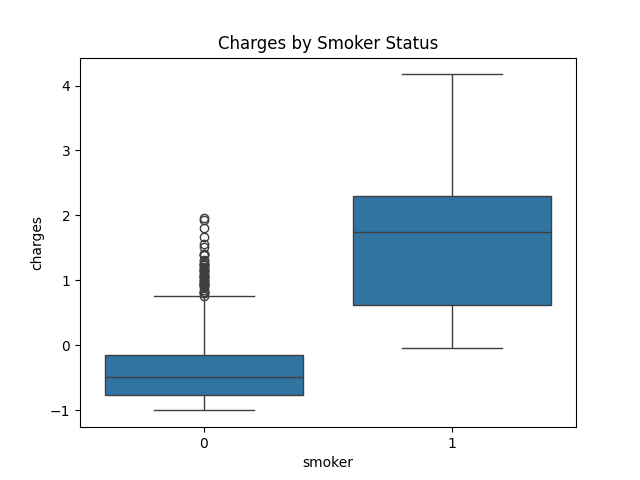
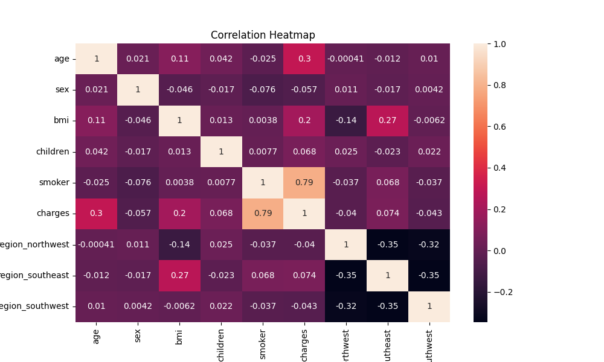
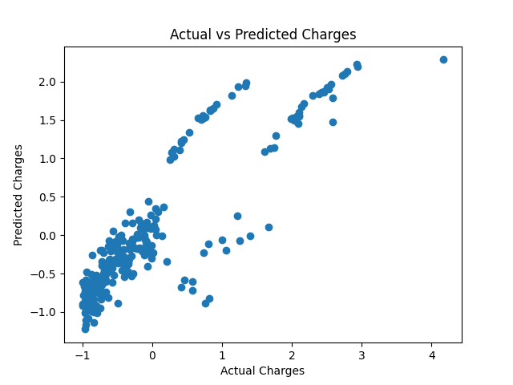
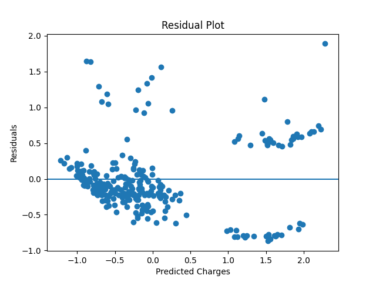

# medical-insurance-cost-prediction
Linear Regression project for predicting medical insurance charges using Machine Learning.
# Medical Insurance Cost Prediction Using Linear Regression

## Project Overview

This project uses Machine Learning and Linear Regression to predict medical insurance charges based on demographic and health-related features such as age, BMI, smoking status, sex, and number of children.

The project demonstrates:
- Data cleaning and preprocessing
- Exploratory Data Analysis (EDA)
- Feature encoding and scaling
- Linear Regression model training
- Model evaluation and visualization

---

## Dataset Information

Dataset: Medical Cost Personal Dataset

Features used:
- age
- sex
- bmi
- children
- smoker
- region

Target variable:
- charges

---

## Technologies Used

- Python
- Pandas
- NumPy
- Matplotlib
- Seaborn
- Scikit-learn
- Jupyter Notebook

---

## Data Cleaning & Preprocessing

The following preprocessing steps were performed:
- Checked for missing values
- Label encoded binary categorical variables
- Applied One-Hot Encoding to the region column
- Standardized numerical features such as age and BMI

---

## Exploratory Data Analysis (EDA)

The following visualizations were created:
- Histogram of insurance charges
- Boxplot of charges by smoker status
- Correlation heatmap
- Regression result visualizations

Key findings:
- Smokers have significantly higher medical charges
- BMI and age positively affect charges
- Smoking status is the strongest predictor

---

## Machine Learning Model

Algorithm used:
- Linear Regression

Steps performed:
1. Train-test split (80/20)
2. Model training using LinearRegression()
3. Prediction on test data
4. Model evaluation

---

## Evaluation Metrics

Metrics used:
- Mean Absolute Error (MAE)
- Mean Squared Error (MSE)
- R² Score

The model achieved good prediction performance and explained a large portion of variation in medical insurance charges.

---

## Visualizations

### Histogram of Charges

### Charges by Smoker

### Correlation Heatmap

### Actual vs Predicted Charges

### Residual Plot

---

## Project Structure

medical-insurance-cost-prediction/

├── LRmodeleval_insurance.ipynb  
├── Linearreg_datacleaning.ipynb  
├── cleaned_insurance.csv  
├── insurance.csv  
├── README.md  

└── images/  
  ├── histogram.png  
  ├── boxplot.png  
  ├── heatmap.png  
  ├── actual_vs_predicted.png  
  └── residual_plot.png  

---

## How to Run the Project

1. Download the repository
2. Open the notebook files in Jupyter Notebook
3. Install required libraries
4. Run all notebook cells

Required libraries:

- pandas
- numpy
- matplotlib
- seaborn
- scikit-learn

---

## About Me

I am passionate about Data Science and Machine Learning. I enjoy solving real-world problems using data analysis, visualization, and predictive modeling. This project showcases my skills in data preprocessing, exploratory data analysis, and regression modeling.

---

## Future Improvements

Possible future improvements:
- Try advanced regression models
- Improve prediction accuracy
- Deploy model as a web application
- Perform additional feature engineering
